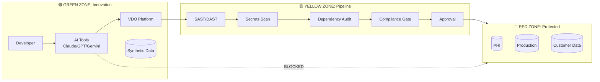

# Visual Concepts for Zero Trust AI Development Article

## Visual 1: Zone Architecture with Pipeline

### Concept
Three horizontal zones flowing left to right:
- **Green Zone** (left): Innovation & Development - where AI tools operate freely
- **Yellow Zone** (center): Validation Pipeline - security gates, scanning, approval
- **Red Zone** (right): Protected Assets - PHI, production, customer data

Key visual elements:
- AI tool icons (Claude, GPT, Gemini) only appear in Green Zone
- Arrows show code flowing Green → Yellow → Red
- Yellow Zone shows gate/checkpoint imagery
- Red Zone has lock/shield iconography
- Clear boundary lines between zones

### Eraser.io Prompt

```
Create a horizontal architecture diagram showing three security zones for AI-enabled development:

LEFT SECTION - "GREEN ZONE: Innovation"
- Color: Green background
- Contains: Developer workstation icon, AI icons (labeled Claude, GPT, Gemini), GitHub logo, "VDO" box, "Synthetic Data" database icon
- Label below: "Full AI Access | External APIs | Rapid Iteration"

CENTER SECTION - "YELLOW ZONE: Pipeline" 
- Color: Yellow/amber background
- Contains: Vertical pipeline with gates showing: "SAST/DAST" → "Secrets Scan" → "Dependency Audit" → "Compliance Check" → "Approval Gate"
- Arrows flowing through from left to right
- Label below: "Validation | Scanning | Human Review"

RIGHT SECTION - "RED ZONE: Protected"
- Color: Red background
- Contains: Database icons labeled "PHI", "Production DB", "Customer Data", shield/lock icons
- Label below: "Encryption | Strict IAM | Audit Logging | No External AI"

Show arrows flowing from Green through Yellow to Red, with a barrier/gate between Yellow and Red.

Add a crossed-out arrow trying to go directly from Green to Red, labeled "Blocked by Design"

Style: Clean, professional, minimal, suitable for business publication
```

### Mermaid.js Alternative (simpler, renders in markdown)



---

## Visual 2: Risk-Tiered Enablement

### Concept
Road/highway metaphor with four lanes, each representing a tier. Shows that speed (velocity/freedom) and controls vary by context. Same vehicle (AI tool) operates at different speeds depending on which road it's on.

Alternative: Speedometer with four zones marked, needle pointing to different positions based on data context.

### Eraser.io Prompt

```
Create a visual showing four parallel horizontal lanes like a highway, representing risk tiers for AI development:

TOP LANE - "TIER 4: School Zone"
- Speed limit sign: "20 MPH"
- Color: Red
- Icons: Hospital, bank, lock symbols
- Labels: "PHI/PII Adjacent | Private AI Only | Human-in-Loop | Full Audit"
- Few/slow cars

SECOND LANE - "TIER 3: Highway" 
- Speed limit sign: "65 MPH"
- Color: Orange/Yellow
- Icons: Office building, multiple people
- Labels: "Enterprise Scale | Audit Logging | Approval Workflows | DLP"
- Moderate traffic, moving steadily

THIRD LANE - "TIER 2: Farm Road"
- Speed limit sign: "45 MPH"  
- Color: Light Green
- Icons: Small team, internal tools
- Labels: "Small Team | Secrets Management | Basic Auth | Peer Review"
- Light traffic, moving freely

BOTTOM LANE - "TIER 1: Private Track"
- No speed limit sign, or "UNLIMITED"
- Color: Bright Green
- Icons: Single person, racing flag
- Labels: "Solo/Research | Personal Risk | Maximum Velocity | Minimal Controls"
- Fast cars, open road

On the right side, show the same car (labeled "AI Coding Assistant") with dotted lines to each lane, indicating: "Same tool, different context, different rules"

Style: Clean infographic style, professional, suitable for LinkedIn
```

### Alternative: Concentric Circles

```
Create a concentric circle diagram for risk-tiered AI development controls:

OUTER RING (largest) - Green - "TIER 1: Private Track"
- Label: "Maximum Velocity"
- Controls listed: "None required"

SECOND RING - Light Green - "TIER 2: Farm Road"  
- Label: "Team Development"
- Controls: "Secrets mgmt, Basic auth"

THIRD RING - Yellow - "TIER 3: Highway"
- Label: "Enterprise"
- Controls: "Audit logging, DLP, Approvals"

CENTER CIRCLE (smallest) - Red - "TIER 4: School Zone"
- Label: "Regulated Data"
- Controls: "Private AI, Human-in-loop, Full compliance"

Arrow pointing inward labeled: "Increasing Controls"
Arrow pointing outward labeled: "Increasing Velocity"

Center has icon of sensitive data (PHI, PII)
Outer edge has icons of AI tools freely operating
```

---

## Visual 3: Combined Single Graphic (Hero Image)

### Eraser.io Prompt for Combined Visual

```
Create a professional infographic combining zone architecture with risk tiering:

TOP HALF: Three-zone horizontal flow
- Green box (left): "INNOVATION ZONE" with AI tool icons, developer icon
- Yellow box (center): "VALIDATION PIPELINE" with gate/checkpoint icon, list: Scan → Test → Approve
- Red box (right): "PROTECTED ZONE" with lock icon, shield, database

Arrow flowing left to right through all three
Dotted line with X showing AI tools cannot bypass to Red Zone directly

BOTTOM HALF: Risk tier spectrum
- Horizontal bar gradient from green (left) to red (right)
- Four markers along the bar:
  - Green end: "Tier 1: Private Track - Full Speed"
  - Light green: "Tier 2: Farm Road - Light Controls"  
  - Yellow: "Tier 3: Highway - Moderate Controls"
  - Red end: "Tier 4: School Zone - Maximum Controls"

Center text: "Context Determines Controls, Not Tools"

Footer: "Zero Trust for AI-Enabled Development"

Style: Modern, clean, dark background with colored elements, suitable for LinkedIn featured image
```

---

## Tool Recommendations

| Tool | Best For | Ease |
|------|----------|------|
| **Eraser.io** | Professional diagrams from prompts | Medium - may need iteration |
| **Mermaid.js** | Quick diagrams in markdown/GitHub | Easy - but limited styling |
| **Excalidraw** | Hand-drawn aesthetic, fast | Easy - manual drawing |
| **Figma** | Polished, publication-ready | Medium - manual but precise |
| **Napkin.ai** | AI-generated visuals from text | Easy - newer tool, good for concepts |
| **Gamma.app** | If making this a presentation | Easy - already familiar |

My recommendation: Try **Eraser.io** first with the combined visual prompt. If it doesn't nail it, use **Napkin.ai** for a quick concept, then polish in **Figma** or **Canva** if needed for LinkedIn.

---

## Color Palette (for consistency)

| Zone | Hex | RGB |
|------|-----|-----|
| Green Zone | #22C55E | 34, 197, 94 |
| Yellow Zone | #EAB308 | 234, 179, 8 |
| Red Zone | #EF4444 | 239, 68, 68 |
| Background (dark) | #1E293B | 30, 41, 59 |
| Text (light) | #F8FAFC | 248, 250, 252 |
